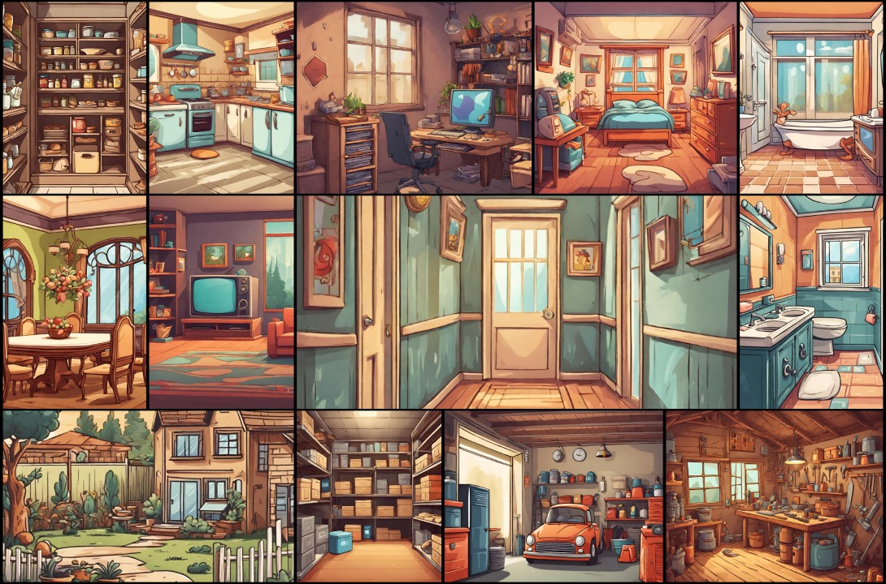

# Desafio dos Fragmentos Acadêmicos - Jogo Java

Este é um projeto desenvolvido em Java como parte da disciplina de Programação Orientada a Objetos (PPOO). O jogo, intitulado "Desafio dos Fragmentos Acadêmicos", tem como objetivo ajudar o estudante Zephyrion a encontrar os fragmentos de seus trabalhos espalhados pelos cômodos de sua casa.

## Sobre o Jogo

O Desafio dos Fragmentos Acadêmicos se passa nos minutos finais do segundo semestre de 2023 na Universidade Federal de Lavras. Zephyrion, estudante de Sistemas de Informação, está sobrecarregado com disciplinas e precisa entregar quatro trabalhos a tempo. O jogador assume o papel de Zephyrion e deve explorar os cômodos da casa para coletar os fragmentos dos trabalhos.

## Funcionalidades

- **Mapa da Casa:** O jogo se desenrola em uma casa com vários cômodos interconectados, cada um contendo três pen drives.
  
- **Tipos de Pen Drives:**
  - Contém o fragmento da Disciplina X.
  - Reduz 5 segundos no tempo de cada matéria.
  - Aumenta 10 segundos no tempo de cada matéria.

- **Disciplinas:**
  - PPOO
  - LFA
  - GRAFOS
  - SGBD

- **Tempo de Entrega:**
  - O tempo de entrega no campus virtual varia aleatoriamente entre 90 e 120 segundos.

- **Objetivo do Jogo:**
  - Coletar todos os fragmentos e levá-los ao cômodo "Meu Quarto" antes do fechamento do Campus Virtual.

- **Interface Gráfica (GUI):**
  - Apresenta o mapa da casa e as opções disponíveis para o jogador.

## Requisitos do Projeto

O projeto atende aos seguintes requisitos estabelecidos pela disciplina:

- Uso correto dos conceitos de Orientação a Objetos.
- Utilização de composição e/ou agregação.
- Aplicação de herança.
- Incorporação de polimorfismo (variáveis e métodos polimórficos).
- Design de classes robusto.
- Utilização de arquivo(s) de texto.
- Implementação de tratamento de exceção.
- Presença de uma interface gráfica (GUI).
- Inclusão do diagrama de classes UML junto com a implementação.
- Código com boa legibilidade, organização e comentários relevantes.
- Documentação adequada no formato Javadoc.

## Instruções de Execução

1. Clone o repositório para sua máquina local.
2. Abra o projeto em seu ambiente de desenvolvimento Java.
3. Execute o arquivo principal para iniciar o jogo.

## Capturas de Tela

Inclua aqui algumas capturas de tela da interface gráfica do jogo, conforme apresentado na Figura 2.

## Contribuições

Contribuições são bem-vindas. Se encontrar problemas ou tiver sugestões, sinta-se à vontade para abrir uma _issue_.

